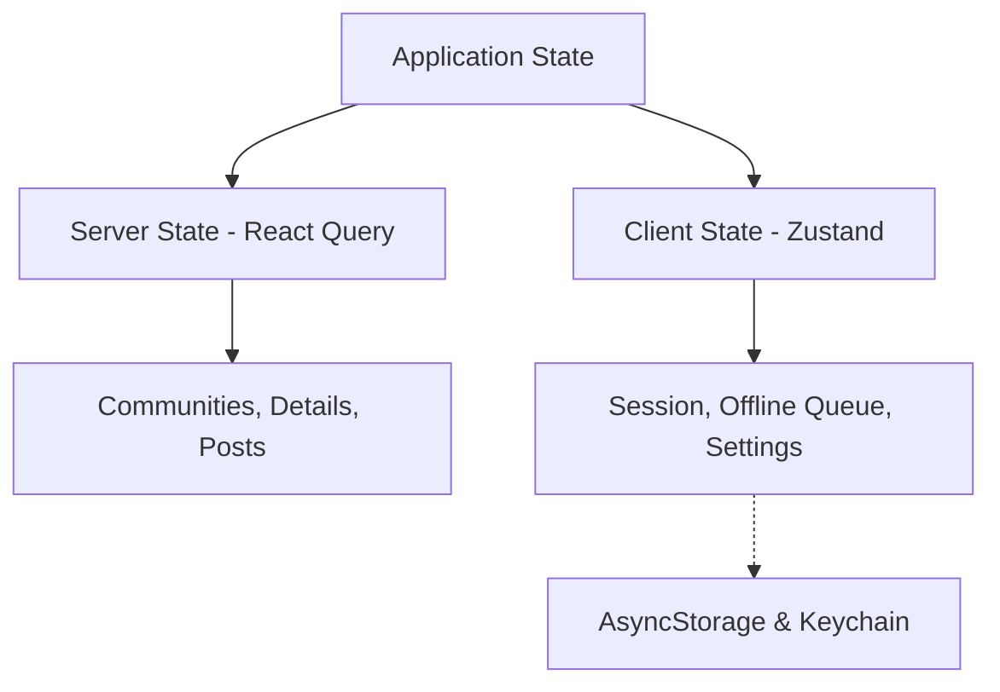
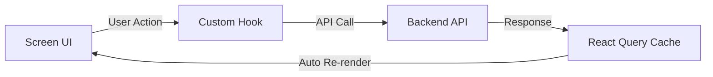
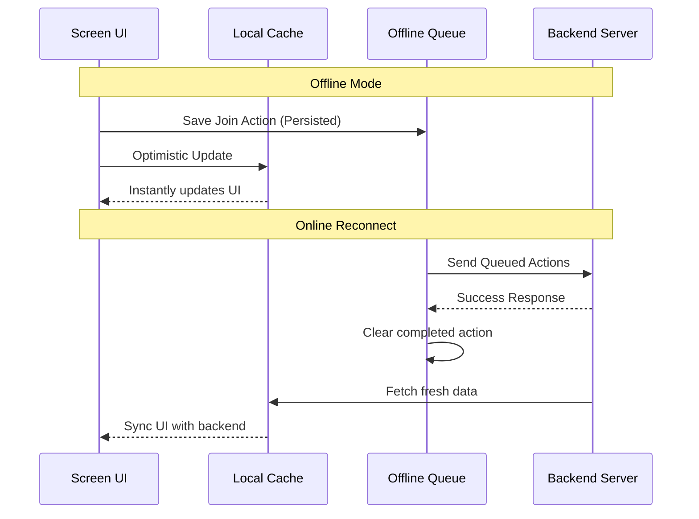

# 🌐 Community Hub

[](https://reactnative.dev/)
[](https://www.typescriptlang.org/)
[](https://tanstack.com/query/latest)
[](https://github.com/pmndrs/zustand)
[](https://opensource.org/licenses/MIT)

**Community Hub** is a high-performance, offline-first React Native mobile application built as a senior engineering assessment. It enables users to browse, search, and join local communities, write and manage posts, and interact seamlessly even under poor or completely disconnected network environments. 

---

## 📱 Product Showcase (Key Features)

*   **🔒 Session Security (Mocked)**: Email/password authentication flow backed by a Zustand session manager. The sensitive authorization token is securely stored in device keychain using `react-native-keychain`, while non-sensitive user metadata is persisted in `AsyncStorage` to automatically restore session status across restarts.
*   **📋 High-Performance Listings**: Paginated list of communities using `@shopify/flash-list` for smooth 60fps rendering, supporting search queries, multiple sorting methods (`name_asc`, `name_desc`, `members_desc`), and pull-to-refresh.
*   **💬 Interactive Communities**: Tab-organized screens to inspect community details and statistics alongside a separate scrollable posts stream, complete with independent pull-to-refresh behaviors.
*   **📝 Optimistic Posting Form**: Post creation screen powered by `react-hook-form` and `yup` validation. Submissions appear immediately in the feed using optimistic React Query updates, with full error handling and manual retry buttons for failed requests.
*   **📶 Offline Resilience**: Global network listening via `NetInfo` that triggers a subtle offline banner. Reads load instantly from the local query cache, and offline actions (like joining/leaving a community) are held inside a synchronized queue and executed automatically when connection recovers.
*   **🎨 Premium Fluid Design**: Sleek dark-mode compatible design system featuring glassmorphic floating docks, subtle animations using `react-native-reanimated`, custom loading micro-interactions, and visual states.
*   **🚀 Native Splash Screens**: Clean, edge-to-edge native launch views matching the design theme on both iOS (LaunchScreen.storyboard auto-layout) and Android (`react-native-splash-view` overlay).

---

## 🛠️ Setup & Running Instructions

### Prerequisites
Before running, make sure your machine has the following tools set up:
*   **Node.js**: Version 18.x or 20.x
*   **Yarn** or **npm**
*   **Watchman**: `brew install watchman` (macOS)
*   **CocoaPods**: For iOS dependencies (`sudo gem install cocoapods`)
*   **Xcode** & **Android Studio** configured with simulators/emulators.

### 🌐 Backend Service Configuration
The API and database server are hosted in a separate Git repository:
*   **Backend Repo**: [hi-kuldeep/community-hub-backend](https://github.com/hi-kuldeep/community-hub-backend)
Please follow the instructions in the backend repository to set up and run the server before launching this mobile application.

### 1. Installation
Clone the repository and install dependency packages:
```bash
# Install node packages
yarn install
# or
npm install
```

If targetting iOS, configure and install CocoaPods:
```bash
cd ios
pod install
cd ..
```

### 2. Launching the App
1.  **Start Metro Bundler**:
    ```bash
    yarn start
    ```
2.  **Run Application**:
    *   **iOS**: `yarn ios`
    *   **Android**: `yarn android`

---

## 📐 Architecture Overview

The codebase is organized to enforce a strict **separation of concerns** (SoC), ensuring high testability, maintainability, and clean boundaries.

```
src/
├── assets/         # App static resources (images, vector icons, lottie assets)
├── components/     # Globally shared reusable UI widgets and providers
│   ├── modalProvider/   # Centralized global overlay alert system
│   ├── OfflineBanner/   # Network status connection banner
│   └── ScreenHeader.tsx # Universal screen-specific navigation headers
├── constants/      # Shared constant mappings and static configs
├── hooks/          # Cross-cutting custom hooks (e.g. useCommunityJoinQueue)
├── localization/   # i18n localization setup and string translations
├── navigation/     # Navigators, type-safe stack param definitions
├── screens/        # Screen-level modules grouped by feature domain
├── services/       # API call interfaces and TanStack Query configurations
├── store/          # Zustand client/UI stores (Auth, UI settings, Offline queue)
├── theme/          # Design tokens (colors.ts, spacing.ts, typography.ts)
├── types/          # Core TypeScript definitions (community.d.ts)
└── utils/          # General utility helpers
```

### 🔒 Strict Screen Component Structure
To avoid bloated, hard-to-test UI files, every screen directory follows a strict component architecture:
```
ScreenName/
├── ScreenName.tsx        # Pure UI markup rendering & hook consumption
├── useScreenName.ts      # Business logic: state, forms, API mutations & navigation
├── screenName.styles.ts  # Stylesheets using shared theme design tokens
├── index.ts              # Module entry point
└── components/           # Private, screen-only subcomponents
```
1.  **`ScreenName.tsx`**: A functional component containing only rendering tags, layouts, and style references. It is completely logic-free and simply consumes output parameters from `useScreenName`.
2.  **`useScreenName.ts`**: A custom hook containing React Query calls, mutations, navigation hooks, local states, forms, and business logic.
3.  **`screenName.styles.ts`**: Pure `StyleSheet.create()` styles. Inline styles are strictly banned, ensuring a single source of truth for styles referencing design tokens.

---

## 💾 State Management & Data Flow

The application divides state into two logical layers: **Server State** (data fetched from remote endpoints) and **Client/UI State** (local session, visual settings, and transient structures).



### Unidirectional Data Flow
States undergo a strict unidirectional flow to ensure predictability:



---

## 📶 Offline-First Implementation Strategy

The offline architecture guarantees the application is functional and responsive even without an active internet connection.



*   **Caching Reads**: React Query acts as the client-side data repository. The fetch strategies use configured cache windows and retries, loading details instantly from cached states when offline.
*   **Queuing Writes**: Offline toggles (join/leave actions) bypass server mutations, writing straight to the **Zustand Offline Queue** persisted in `AsyncStorage`. Cache records are optimistically modified so the UI changes instantly.
*   **Dynamic Synchronization**: The [useOfflineQueueSync](file:///Users/kuldeep/kuldeep/communityHub/src/hooks/useOfflineQueueSync.ts) sync listener detects reconnection, processing queue tasks chronologically. If an action fails with a `4xx/5xx` response, it is discarded to prevent blocking the queue and a localized alert is shown. If it fails due to network loss, execution pauses until connection returns.

---

## ⚙️ Technical Choices & Tradeoffs

| Decision | Choice | Why | Tradeoff |
| :--- | :--- | :--- | :--- |
| **Remote Data & Caching** | React Query (TanStack) | Handles remote caching, queries/mutations, automatic retries, pagination, and caching out of the box. | Requires understanding stale/cache timers, but drastically cuts async state boilerplate. |
| **Lightweight Global Client State** | Zustand | Zero-boilerplate global state management. Extremely lightweight, performant, and does not trigger parent re-renders. | Lacks complex middleware ecosystems like Redux Sagas, but perfect for lightweight client state. |
| **High-Performance List Rendering** | `@shopify/flash-list` | Reuses cell views to prevent garbage collection spikes. Ideal for maintaining 60fps scrolling in long lists. | Requires careful item layout sizing to prevent visual layout shifts during view recycling. |
| **Local Cache & Queue Persistence** | Zustand Persist + AsyncStorage | Quick to implement, lightweight, and perfect for simple state persistence like user preferences and offline sync queues. | Not suited for complex relational databases, but highly sufficient for queue/preference operations. |
| **Secure Credential Management** | `react-native-keychain` | Secures sensitive authorization tokens in the iOS Keychain and Android Keystore, preventing token theft through standard storage inspection. | Slightly more complex API, but critical for enterprise security compliance. |
| **Shared Offline Queue Handler** | Generic `useCommunityJoinQueue` Hook | Extracted standard community join/leave queue/optimistic logic into a shared custom hook. Detail and list views use a unified path for joining. | Slight abstraction, but guarantees identical offline/online sync logic across the app. |

---

## 📐 Verification & Quality Checks

Run the following commands to ensure strict type compliance and check project formatting rules:

```bash
# Run TypeScript compilation check
npx tsc --noEmit

# Run ESLint check
yarn lint
```

---

## 🚀 Production Roadmap & Future Enhancements

If given additional timeline, the following architecture upgrades would be implemented:
1.  **Background Sync Engine**: Integrate `react-native-background-fetch` or work manager queues to replay the offline sync queue even when the app is backgrounded or terminated.
2.  **Comprehensive Component Testing**: Set up `@testing-library/react-native` tests for core custom hooks (`useScreenName.ts` hooks), utilizing `msw` (Mock Service Worker) to mock API responses at the network layer.
3.  **Encrypted Database**: Upgrade local state persistence (Zustand queues/cache) to use SQLCipher or MMKV with encryption keys retrieved from `react-native-keychain` to secure offline queues.
4.  **Auto-generated API SDK**: Generate TypeScript axios instances directly from an OpenAPI/Swagger definition using `openapi-typescript-codegen` to guarantee strict API contracts between frontend and backend.
5.  **CI/CD Pipeline**: Integrate GitHub Actions with Fastlane to automate builds, trigger TypeScript validation, run tests, and publish staging builds directly to TestFlight and Play Store internal tracks.
