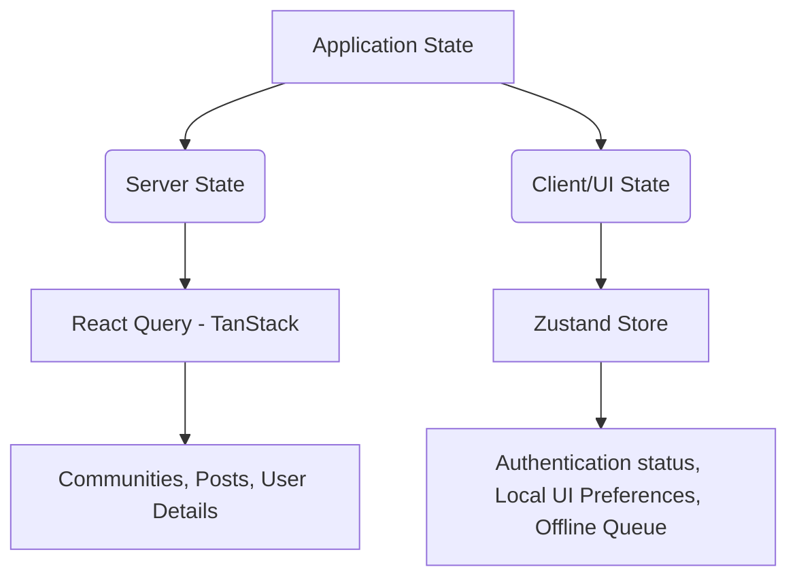

# Community Hub

Community Hub is a scalable, highly maintainable, and production-ready React Native application built to serve as a high-performance community platform. It is engineered with offline-first support, strong TypeScript contracts, a strict architecture that separates UI from business logic, and dynamic theme synchronization.

---

## 🛠️ Setup Instructions

### Prerequisites
Before running the project, ensure you have the following installed on your machine:
* **Node.js**: Version 18.x or 20.x (Recommended)
* **npm** or **Yarn**
* **Watchman**: `brew install watchman` (macOS)
* **CocoaPods**: For iOS dependencies (`sudo gem install cocoapods`)
* **Xcode**: (For running on iOS Simulator / Devices)
* **Android Studio**: Including SDK, Platform Tools, and Emulator (For running on Android)

### 1. Installation Steps
Clone the repository and install the dependencies from the root directory:

```bash
# Clone the repository
git clone <repository-url>
cd communityHub

# Install package dependencies
npm install
```

For iOS devices/simulators, install the native pod dependencies:

```bash
# Install Cocoapods
cd ios && pod install && cd ..
```

### 2. Environment Configuration
Create a `.env` file in the root directory of the project (if configuring environment variables via react-native-config or similar library), or set the core configurations inside `src/services/api/axiosInstance.ts`:

```env
API_BASE_URL=https://api.communityhub.com/v1
```

> [!NOTE]
> Currently, the base API URL is configured globally inside the axios instance at [axiosInstance.ts](file:///Users/kuldeep/kuldeep/communityHub/src/services/api/axiosInstance.ts).

### 3. Running the Application

First, start the Metro bundler to compile and serve the JavaScript bundle:

```bash
npm start
```

Once the bundler is running, open a new terminal window to launch the app on your preferred platform:

#### Run on iOS Simulator
```bash
npm run ios
```

#### Run on Android Emulator
```bash
npm run android
```

---

## 📐 Architecture Overview

### 1. Project Structure
The application adopts a feature-modular and layer-separated structure under the `src` directory to ensure high scalability as the product grows:

```
src/
├── assets/         # App static assets (images, icons, lottie animations)
├── components/     # Shared reusable UI elements and providers
│   ├── modalProvider/                # Global loading/error/alert overlays
│   ├── refreshControlComponent/      # Custom theme-adaptive RefreshControl
│   ├── reuseableModalizeBottomSheet/ # Bottom sheet modals
│   ├── CustomButton.tsx
│   └── CustomText.tsx
├── constants/      # App constants and configurations
├── hooks/          # Global reusable custom React hooks (form handler, pagination)
├── localization/   # i18n translation setups and language dictionaries
├── navigation/     # Navigators, stacks, and routing params type-definitions
│   ├── authStackNavigator/ # Login/Auth routes
│   └── rootStackNavigator/ # Global app root container
├── screens/        # Screen modules grouped by business domain
│   └── login/      # Auth screen module
├── services/       # Network API layers and React Query clients
│   └── api/        # Axios interceptors and requests
├── store/          # Zustand global clients/UI state stores
├── theme/          # Design system styling tokens (colors, typography, spacing)
├── types/          # Core TypeScript interfaces and shared schemas
└── utils/          # Generic helper functions and debug tools
```

#### 🔒 Strict Screen Architecture Rule
To prevent screens from turning into bloated, hard-to-test components, every screen module follows a strict structure:
```
ScreenName/
├── ScreenName.tsx        # Pure UI markup rendering & hook consumption
├── useScreenName.ts      # Business logic: queries, mutations, navigation & validation hooks
├── screenName.styles.ts  # Stylesheet definitions mapped to dynamic theme tokens
├── index.ts              # Entry export index
└── components/           # Private, screen-only reusable elements
```
* **ScreenName.tsx**: Contains only UI components and layout hooks. No API queries, state updates, or business logic.
* **useScreenName.ts**: Houses React Query hooks, Zustand triggers, state logic, form schema validations, and navigation calls.
* **screenName.styles.ts**: Custom StyleSheet styles using theme tokens. Inlining of styles is strictly prohibited.

---

### 2. State Management Approach

The project separates state into two categories depending on the nature of the data:



* **Server State (React Query)**:
  Handles all remote endpoint fetches, caching, cache invalidation, pagination, loading/error states, retries, and optimistic updates.
* **Client / UI State (Zustand)**:
  Handles fast-changing, lightweight local configurations, persistent themes, active token states, and offline task queues. We persist store selections using AsyncStorage with Zustand's persist middleware.

---

### 3. Data Flow
The data flow in Community Hub is strictly unidirectional to simplify tracing bugs and maintaining predictable states:

```
[User Action on Screen] 
       │
       ▼
[Trigger useScreen hook method] 
       │
       ▼
[Axios Service / React Query Mutation] 
       │
       ▼
[API Server Request] ────(Success)────► [React Query Cache Invalidation]
       │                                             │
    (Failure)                                        ▼
       │                              [Auto Re-render of Screen UI]
       ▼
[Global Modal Toast Alert (Error Modal)]
```

---

### 4. Offline Strategy
Community Hub is architected with an **offline-first** mindset to ensure users have a seamless experience under flaky connections:

* **Offline Detection**: NetInfo subscribes to network status changes and triggers an offline banner overlay.
* **Cached Content**: React Query retains data locally inside the query cache. When offline, screens load from the cached state.
* **Offline Action Queue**: Unsent mutations (e.g., joining a community, writing a post) are captured inside a Zustand-managed offline action queue.
* **Sync on Reconnect**: When NetInfo reports the network status is back online, the synchronization manager processes queue operations sequentially to reconcile data with the backend.

---

## ⚖️ Key Decisions & Tradeoffs

### 1. Modular Hook Pattern (`useScreenName.ts`)
* **Decision**: Extract all logic into a custom screen-level hook.
* **Pros**: Decouples logic from UI components completely. Allows screens to be mock-tested easily by stubbing hooks. Improves readability.
* **Tradeoff**: Increases files per screen module, adding boilerplate setup time for simple screens. However, this pays off quickly as logic grows.

### 2. Unified Toast & Modal System (`ModalProvider.tsx`)
* **Decision**: A centralized provider wrapping the app container which handles showing loading spinners, success prompts, and network errors.
* **Pros**: Removes the need to import, initialize, and maintain overlay components in individual screens.
* **Tradeoff**: Renders modal components globally, which could limit screen-specific modal customization. To mitigate this, standard overlays are kept modular with customized configuration properties.

### 3. Zustand + AsyncStorage over Redux / MobX
* **Decision**: Lightweight global client state.
* **Pros**: Near-zero boilerplate. Extremely performant as it does not rely on React Context wrapping. Persistence helper middleware hooks directly to AsyncStorage.
* **Tradeoff**: Does not feature standard DevTools capabilities as comprehensive as Redux, but it is highly suited for React Native where size and speed are primary factors.

### 4. Typed Navigation Config
* **Decision**: Strict TypeScript definitions for parameters across Auth and Root stacks.
* **Pros**: Eliminates navigation parameter type issues and crashes during compile time.
* **Tradeoff**: Demands manual param updates in type files when routes shift, but this saves significant debug hours.

---

## 🚀 Future Improvements

1. **Robust Offline Sync Replay Manager**:
   Develop a background sync task engine using `react-native-background-fetch` or work managers to background-sync queued actions even when the app is minimized.
2. **Comprehensive Jest Test Suite**:
   Implement unit tests for client hooks (`useScreenName.ts`) and stores using `@testing-library/react-native`, mocking Axios responses with Mock Service Worker (MSW).
3. **Advanced Rendering Performance**:
   Extend `@shopify/flash-list` integration on community listings with optimized items using `React.memo` to ensure a consistent 60fps experience even during complex scrolling.
4. **CI/CD Pipeline Setup**:
   Build workflow triggers using GitHub Actions and Fastlane to automatically package iOS `.ipa` and Android `.apk` / `.aab` builds for staging and production testing platforms (TestFlight / Play Console).
